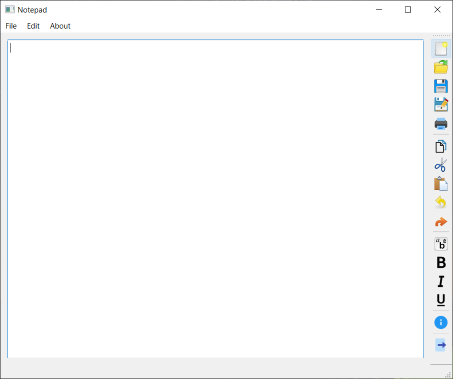

# notepad-app
I thought it would be fun to make a real app, so I made a working Notepad app. I covered Dialogs, Widgets, Drag and Drop Interfaces, Creating / Opening / Saving Files, Menus, Toolbars, Icons, Printing, and much more.

### Environment

    Windows version: 10
    Qt Creator version: 7.0.0

    

